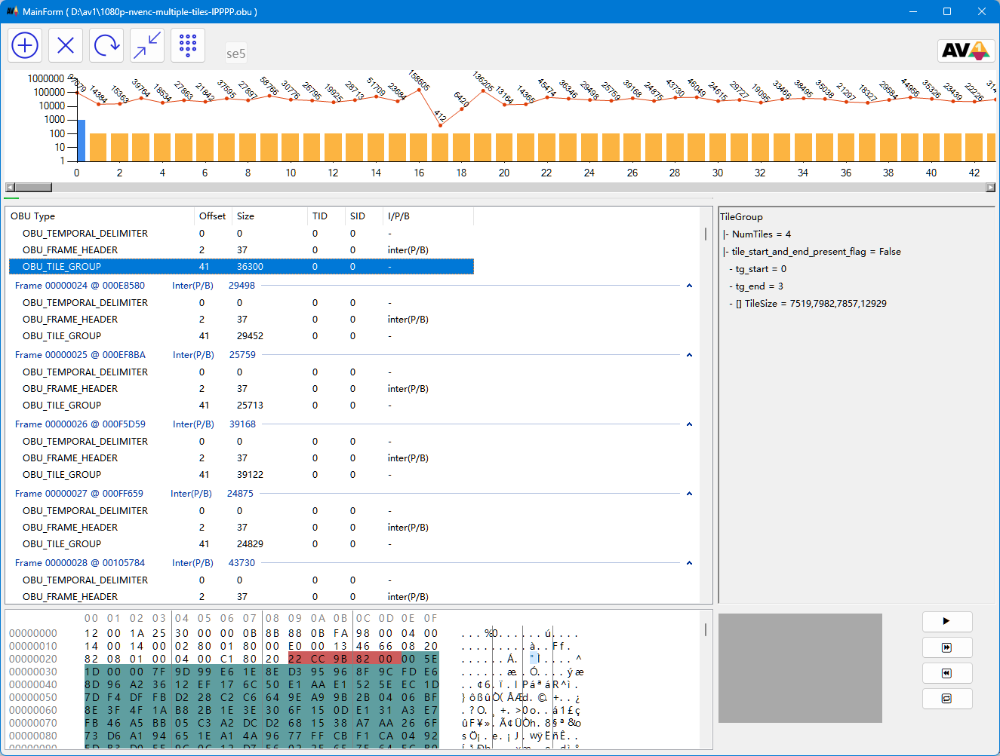
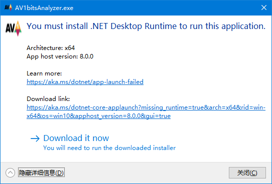

# AV1BSViewer

Translate c version to c# version with simple UI.

### Main Page
#### Expand-Collapse-DataVisualization

#### Play with VLC

#### About

#### Install
- Runtime Warning

- Runtime Warning Detail

## Build
 - Visual Studio 2022 
 - dotnet 6 sdk

## Reference
 * [C Version - github - dwbuiten/obuparse](https://github.com/dwbuiten/obuparse)
 * [dotnet8-runtime-download-url](https://dotnet.microsoft.com/zh-cn/download/dotnet/thank-you/runtime-desktop-8.0.0-windows-x64-installer?cid=getdotnetcore)

